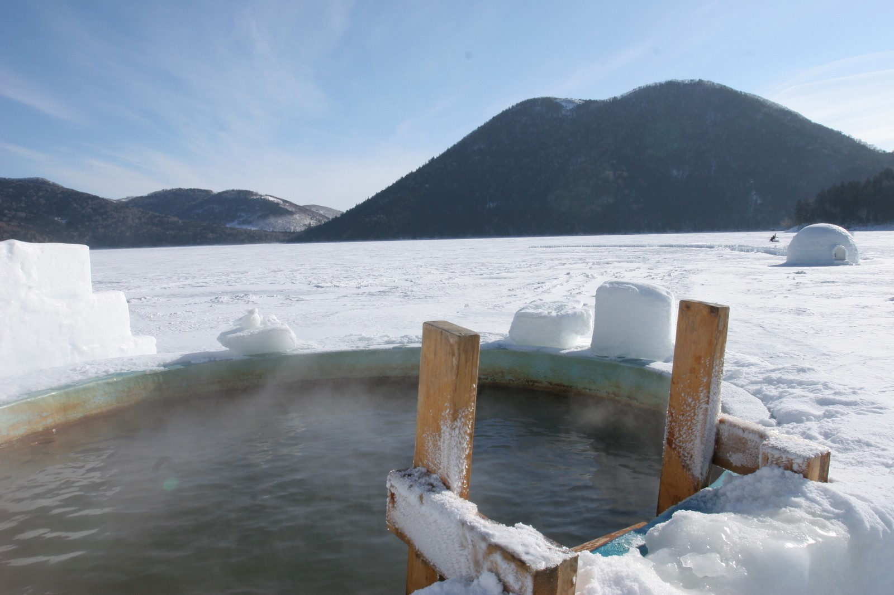

# Lake Mendota Visualization

Given the freezing and thawing times of Lake Mendota over the past couple hundred years create a visualization of the data.

My first attempt at a Reddit visualizaion project.

###### My Process
The best way to show this information was two lines. One when the lake froze over, and another when it thawed. To get this information I'd need Julian dates. To get Julian dates I needed to add the years in the original dataset to the months and days, then that date through a datetime formula to get the Julian Date. 